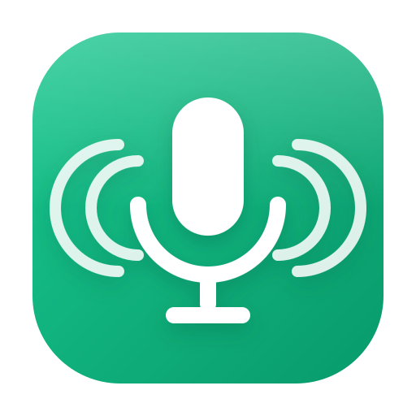
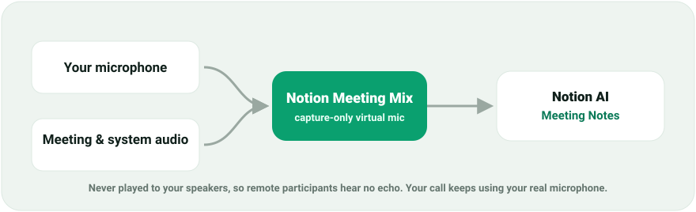

<p align="center">
  
</p>

<h1 align="center">Notion Recorder</h1>

<p align="center"><b>No-echo meeting audio for Notion AI Meeting Notes, on Linux.</b></p>

<p align="center">
  <a href="https://github.com/samuelrawrs/notion-recorder/releases"></a>
  
  <a href="LICENSE"></a>
</p>

<p align="center">
  
</p>

Notion Recorder builds one **capture-only** virtual microphone, **Notion Meeting Mix**,
that blends your microphone with your call and system audio. Notion transcribes both
sides from that single input. The mix is never played back to your speakers, so remote
participants hear no echo, and your real microphone stays selected in Meet, Zoom, and Teams.

> Needs a Debian/Ubuntu system with PipeWire (`pipewire-pulse`) or PulseAudio.

## Install

Recommended: the apt repository, so you get updates with `apt upgrade`.

```bash
curl -fsSL https://samuelrawrs.github.io/notion-recorder/notion-recorder.gpg \
  | sudo tee /usr/share/keyrings/notion-recorder.gpg >/dev/null
echo "deb [signed-by=/usr/share/keyrings/notion-recorder.gpg] https://samuelrawrs.github.io/notion-recorder stable main" \
  | sudo tee /etc/apt/sources.list.d/notion-recorder.list
sudo apt update && sudo apt install notion-recorder
```

<details>
<summary>Prefer a single <code>.deb</code>?</summary>

Download `notion-recorder_<version>_all.deb` from the
[Releases page](https://github.com/samuelrawrs/notion-recorder/releases), then:

```bash
sudo apt install ./notion-recorder_1.0.1_all.deb
```
</details>

## Use in a meeting

1. Open **Notion Recorder** and **Start** the mix (headphones recommended, not required).
2. In Notion, start a fresh transcript and pick **Notion Meeting Mix** as the microphone.
3. Talk and meet as usual. Meet, Zoom, and Teams keep using your real mic, so no echo.
4. When done, stop the transcript in Notion, then **Stop** the mix.

> Changed your mic or speakers? Stop the transcript, restart the mix, reload Notion, start a fresh transcript.

## Optional extras

| Feature | What it does |
| --- | --- |
| **Auto-start** | A background service starts and stops the mix around your calls. Off by default; toggle it in Configuration. |
| **Tray icon** | A top-bar menu to start or stop the mix without opening the window. Off by default. On GNOME, needs the AppIndicator extension. |
| **Skins & zoom** | Mint, Snow, Dark, and Ember themes; zoom with `Ctrl` `+` / `-` / `0`. |

<details>
<summary>Command line, uninstall, and build from source</summary>

**Command line**

```bash
notion-meeting-audio start | stop | restart | status | toggle
```

**Uninstall**

```bash
sudo apt remove notion-recorder
# if you added the apt repository:
sudo rm -f /etc/apt/sources.list.d/notion-recorder.list /usr/share/keyrings/notion-recorder.gpg
```

**Build from source**

```bash
make deb                             # build the .deb into ../
sudo apt install ../notion-recorder_*.deb
# or install into a prefix without packaging:
make install PREFIX=$HOME/.local     # per-user, no root
```

Pushing a `v*.*.*` tag builds the `.deb`, refreshes the signed apt repository, and
creates the GitHub Release automatically (`.github/workflows/release.yml`).
</details>

## Consent

Get the consent required by participants and applicable law before recording or
transcribing a meeting.

## License

MIT. See [LICENSE](LICENSE).
